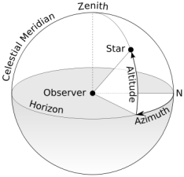
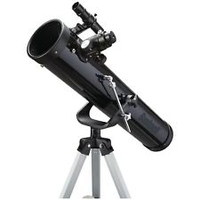
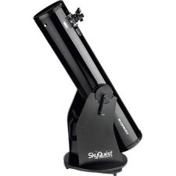

Can I aim a telescope with a Raspberry Pi, some stepper motors, and some open-source software? Let's try!

Can I use **ALL** of the GPIO pins or a Raspberry Pi? Let's try!

 

### Equipment:

* Bushnell Voyager basic telescope (700mm x 76mm)
    * Probably need a mock-up, too - make it from 4" PVC?
* Raspberry Pi (I have both a Zero W and a 3B+, so I need to determine how much horsepower this application needs)
    * I also have protoboards to fit the GPIO of both
* 28BYJ-48 stepper motors and LN2003 drivers (I think I only need two, but I ordered [this five-pack](https://smile.amazon.com/gp/product/B015RQ97W8/) from Amazon)
* LSM303 digital compass (I ordered [this dev board](https://www.adafruit.com/product/1120) from Adafruit)
* Display (I ordered [this TFT display](https://smile.amazon.com/gp/product/B07B4BDWCL/) from Amazon)
    * I can always fall back to [this OLED display](https://smile.amazon.com/gp/product/B00O2LLT30/) if needed
* Limit switches (I ordered [this ten-pack](https://smile.amazon.com/gp/product/B00MFRMFS6/) from Amazon)
* 3/4" fender washers to use as weights (got two 25-packs at Home Depot)
* ~~Telephone handset jacks and cables for connecting motors to control board (ordered from Amazon)~~
* A two-way level (I ordered [this one](https://smile.amazon.com/gp/product/B000EDSSDO/) from Amazon)
* Buttons for user input (I ordered [this pack](https://smile.amazon.com/gp/product/B07CGCPGPT/) from Amazon)
* GPS (I ordered [this unit](https://smile.amazon.com/gp/product/B01H5FNA4K/) from Amazon)

### Source Code:

* My repository: https://github.com/JayAllison/MoonFinder

### Tools:

* Fritzing: http://fritzing.org/home/

### References:

* Python Raspberry Pi GPIO Wrapper Library: https://gpiozero.readthedocs.io/
* Raspberry Pi GPIO Pinout: https://pinout.xyz/
* Stepper motor control with RPi: https://tutorials-raspberrypi.com/how-to-control-a-stepper-motor-with-raspberry-pi-and-l293d-uln2003a/
    * But, my BlindsBot project ended up being a better reference for the step sequence
* LSM303 reading with RPi: https://github.com/adafruit/Adafruit_Python_LSM303/tree/master/examples
* ST7735 Display Library: https://github.com/cskau/Python_ST7735
    * I got the cheap Amazon display I purchased working with the examples using the connections listed below
    * The examples are written for a 160x128 display, this one is 128x128
* Python Image Library fork (pillow): https://pillow.readthedocs.io/en/5.2.x/
* U-Blox U-Center, Windows software for GPS module: https://www.u-blox.com/en/product/u-center-windows
* Serial Port driver: https://pythonhosted.org/pyserial/
* NMEA sentence information: http://aprs.gids.nl/nmea/
* RPi serial port info, per model: https://www.raspberrypi.org/documentation/configuration/uart.md
* gpsd, gpsmon: https://www.rs-online.com/designspark/add-gps-time-and-location-to-a-raspberry-pi-project
    * don't set gpsd to start up automatically or it will monopolize the serial port
* Astronomical positioning library: http://rhodesmill.org/pyephem/
* Python version of World Magnetic Model (offline): https://pypi.org/project/geomag/
* OpenSCAD (parametric 3D modeling): http://www.openscad.org/cheatsheet/

### 3D Models:

* need to design a pan-and-tilt mount for the telescope
* Do I need a counter-balance?
* Do I want to gear down the movement? or use worm gears instead?
* Can I do something kind of like this "Dobsonian" telescope?

### Basic Approach:

* User sets up telescope and verifies that the base is level
* Use compass to orient rotation (azimuth) of telescope to true North
* Use limit switch to orient angle (altitude) of telescope to horizontal
* Use library to calculate apparent position (azimuth, altitude) of desired celestial object
* Use stepper motors to aim telescope to that position
* Use stepper motors to either:
    * hold position
    * track object

### Remaining questions:

* How will the user specify the lat/lon location and altitude?
* How will the user select the celestial object?
* Will all of the libraries work offline, or will an internet connection be required?
* How to determine true north vs magnetic north, based on location?
* How to convert "apparent position" (azimuth, altitude) to pan and tilt rotations?
* How to implement tracking? How smooth do I want it to be?

### Hardware Ideas:

* I2C OLED screen or something similar
* Buttons for inputs (D Pad, 5 button style, etc)?
* Button for screen brightness?

### Software Ideas:

Display a list of known celestial objects that are currently visible?

### Raspberry Pi Setup Tasks:

*These are my standard steps for setting up a secure, headless Raspberry Pi*

- [x] Install Raspbian on RPi0W, add to WiFi, install updates
- [x] Change RPi hostname
- [x] Change locale via raspi-config? No, the new Raspbian setup took care of this.
- [x] Change keyboard layout via raspi-config? Yes, the new Raspbian setup did not take care of this.
- [x] Change timezone via raspi-config? No, the new Raspbian setup took care of this.
- [x] Enable SSH via raspi-config
- [x] Set up key-based SSH authentication
    * http://raspi.tv/2012/how-to-set-up-keys-and-disable-password-login-for-ssh-on-your-raspberry-pi
    * create sshd banner
- [x] Set up IP address emailing (had to use nano -u to remove dos line endings after I scp'd the file over from my PC)
    * https://gist.github.com/Morrolan/2987424#file-check_ip-py 
- [x] Install git? No, it was already installed. (Don't forget to set name and email address, though.)
- [x] Install screen
- [x] Install ipython
- [x] Modify /etc/nanorc to my liking
- [x] Set up RPi to boot w/o GUI via raspi-config
- [x] Set up RPi /etc/wpa_supplicant/wpa_supplicant.conf with WiFi credentials for home & work

### TFT Display Connections:

Display|Raspberry Pi
---|---
5V|any RPi 5V
GND|any RPi GND
GND|NC
NC|NC
NC|NC
LED|I connected this to RPi 3.3V
SCL|RPi SCLK
SDA|RPi MOSI
RS|GPIO 24 (per the example)
RST|GPIO 25 (per the example)
CS|RPi CE0

### Raspberry Pi Header Pin Allocation:

Usage|Pin|Name| |Name|Pin|Usage
----|---|---|---|---|---|---
X|_1_|**3.3V**| |**5V**|2|X
COMPASS|_3_|**I2C SDA (GPIO2)**| |**5V**|_4_|X
COMPASS|_5_|**I2C SCL (GPIO3)**| |**GND**|_6_|X
ERROR_LED|_7_|**GPIO4**| |**(GPIO14) TXD**|_8_|GPS
X|_9_|**GND**| |**(GPIO15) RXD**|_10_|GPS
MOTOR 1|_11_|**GPIO17**| |**(GPIO18) PWM0**|_12_|DISPLAY?
MOTOR 1|_13_|**GPIO27**| |**GND**|_14_|X
MOTOR 1|_15_|**GPIO22**| |**GPIO23**|_16_|MOTOR 1
X|_17_|**3.3V**| |**GPIO24**|_18_|DISPLAY
DISPLAY|_19_|**SPI MOSI (GPIO10)**| |**GND**|_20_|X
DISPLAY|_21_|**SPI MISO (GPIO9)**| |**GPIO25**|_22_|DISPLAY
DISPLAY|_23_|**SPI CLK (GPIO11)**| |**(GPIO8) SPI CE0**|_24_|DISPLAY
X|_25_|G**ND**| |**(GPIO7) SPI CE1**|_26_|SW 1
RESERVED|_27_|**ID_SD**| |**ID_SC**|_28_|RESERVED
MOTOR 2|_29_|**GPIO5**| |**GND**|_30_|X
MOTOR 2|_31_|**GPIO6**| |**GPIO12**|_32_|SW 2
LIMIT SWITCH|_33_|**PWM1 (GPIO13)**| |**GND**|_34_|X
MOTOR 2|_35_|**GPIO19**| |**GPIO16**|_36_|SW 3
MOTOR 2|_37_|**GPIO26**| |**GPIO20**|_38_|SW 4
X|_39_|**GND**| |**GPIO21**|_40_|SW 5

### Wiring to Handset:

* Using two stranded Ethernet cables

Wire|Cable A
---|---
1|5V
2|Display SPI MOSI
3|Display SPI MISO
4|Display SPI CLK
5|Display SPI CS
6|Display RS
7|Display RST
8|Display Backlight PWM

Wire|Cable B
---|---
1|3.3V
2|SW 1
3|SW 2
4|SW 3
5|SW 4
6|SW 5
7|ERROR LED
8|N/C

### Project Tasks:

- [x] Create ssh key for Bitbucket
- [x] Check out moonfinder repository onto RPi
- [x] Write pyephem example to show myself I can do it
- [x] Write stepper example to show myself I can do it
- [x] Enable I2C via raspi-config
- [x] Write compass example to show myself I can do it
- [x] Enable SPI via raspi-config
- [x] Write display example to show myself I can do it
- [x] Disable serial console, enable serial hardware via raspi-config, then reboot
- [x] Write GPS example to show myself I can do it
- [x] Install gpsd & gpsmon (only run gpsd on boot if you want to lose control of serial0!)
- [ ] Work on prototype of pan & tilt bracket
- [* ] Build handset prototype
- [ ] Design menuing software
- [ ] *Task TBD*
- [ ] *Task TBD*
- [ ] *Task TBD*
- [ ] *Task TBD*
- [ ] *Task TBD*
- [ ] *Task TBD*
- [ ] *Task TBD*
- [ ] Put it all together and try it out!
